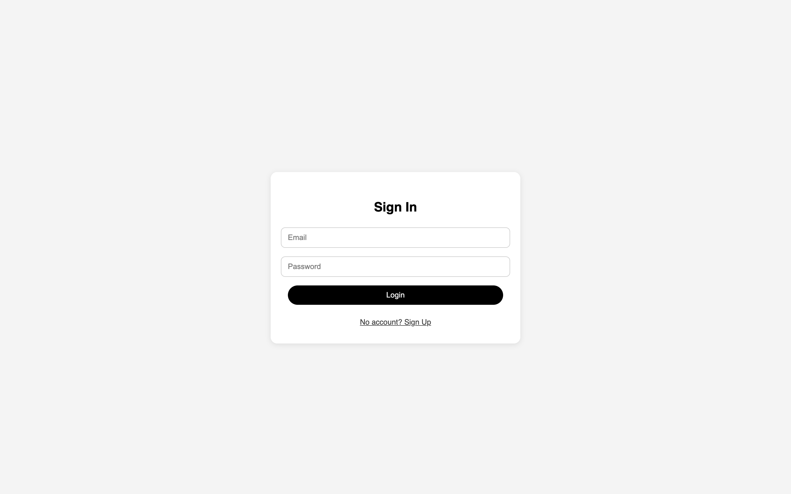
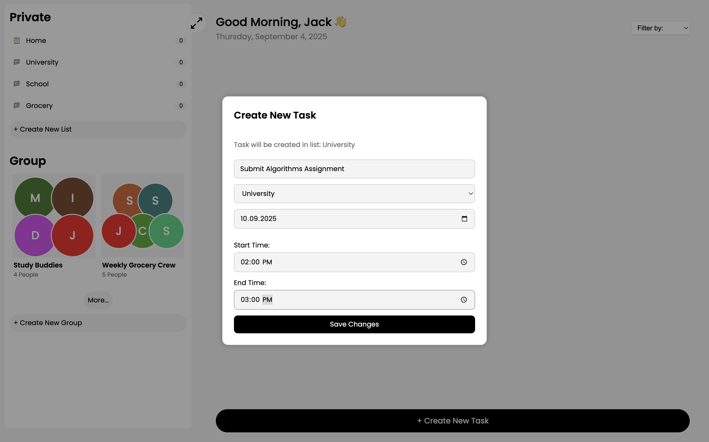
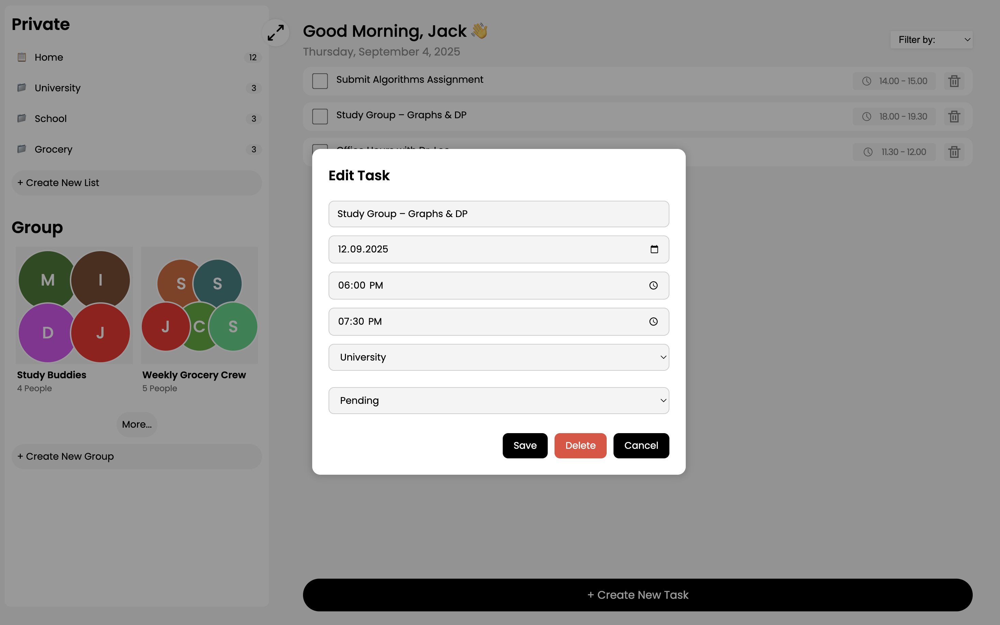
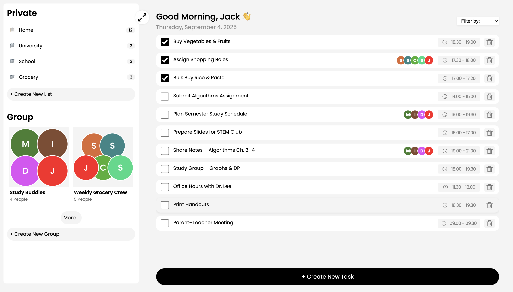

---


<div align="center">


## ✅ ToDo WebApp (Refactored)

Modern task management web application with lists, groups, authentication, and role-based features.

</div>


---

## 📸 Screenshots

<details>
  <summary><b>📸 View screenshots</b></summary>

### 🔐 Login


### 📝 Create Task


### ✏️ Edit Task


### 📋 Task Dashboard


</details>

---

## ✨ Overview

This project is a refactored ToDo WebApp designed to demonstrate a full-stack approach with a clean frontend, modular PHP backend, and MySQL database.

Key features:
	-	👤 Authentication → Register, login, JWT-based auth.
	-	📋 Task Management → Create, edit, delete tasks; filter by due date, priority, or status.
	-	🗂 Lists → Organize tasks into multiple lists (e.g. Personal, Work, Shopping).
	-	👥 Groups → Share and collaborate with other users.
	-	🔑 Role-based Access → Only authenticated users can access data.
	-	🧩 Responsive UI → Adaptive HTML/CSS with modern JavaScript modules.

⚠️ Current stage: core features working locally. README + screenshots showcase functionality.

---

## 🏗 Architecture

```text
frontend/                 → Static UI (HTML, CSS, JS modules)
  └── scripts/            → ES modules (auth, lists, tasks, groups, ui)
backend/                  → PHP routes and services
  ├── auth/               → login.php, register.php, profile.php
  ├── lists/              → CRUD for lists
  ├── tasks/              → CRUD for tasks
  ├── groups/             → group & member endpoints
  ├── users/              → user info endpoints
  ├── middlewares/        → db.php, cors.php, auth.php (JWT validate)
  └── utils/              → jwt.php helper
database/                 → schema.sql, indexes.sql, seeds.sql
docker-compose.yml        → local development stack (php, mysql, static frontend)
```

---

## ⚙️ Technology Stack

```
Layer	    Tools
Frontend	HTML5, CSS3, Vanilla JavaScript (ESM)
Backend	    PHP 8.2 + Apache
Database	MySQL 8 (with schema + seeds)
Auth	    JWT-based authentication
DevOps	    Docker Compose (db + php + frontend)
```

---

## 🚀 Local Development

Clone and run locally with Docker Compose:

git clone https://github.com/you/ToDoWebAppRefactoring-main.git
cd ToDoWebAppRefactoring-main
docker compose up --build

	-	🌐 Frontend → http://localhost:5173
	-	🔌 Backend API → http://localhost:8000
	-	🛢 MySQL DB → localhost:3306

Initialize database:

docker exec -i todo-db mysql -uroot -h127.0.0.1 -e 'CREATE DATABASE IF NOT EXISTS todo_app;'
docker exec -i todo-db mysql -uroot -h127.0.0.1 todo_app < database/schema.sql
docker exec -i todo-db mysql -uroot -h127.0.0.1 todo_app < database/indexes.sql
docker exec -i todo-db mysql -uroot -h127.0.0.1 todo_app < database/seeds.sql


---

## 🧩 Core Features Walkthrough
	1.	User Flow
	-	Register → login → get JWT token.
	-	Profile & session checked with token.
	2.	Lists
	-	Create private task lists.
	-	View tasks per list with counts.
	3.	Tasks
	-	Add tasks with title, due date, priority, status.
	-	Edit or delete tasks.
	-	Filter by today, week, or month.
	4.	Groups
	-	Create groups.
	-	Invite other users (mocked/demo ready).
	-	See group members.
	5.	Responsive UI
	-	Sidebar for lists & groups.
	-	Main panel for tasks.
	-	Modals for CRUD operations.

---

## 🚦 Git Workflow & Code Quality
	-	✅ ESLint + Prettier for frontend JS.
	-	✅ Conventional Commits supported.
	-	✅ Modular PHP backend (routes, middlewares, utils).

Example:

git commit -m "feat(tasks): add priority filter"


---

## 📜 License

MIT License
	-	✅ Free to use, modify, distribute.
	-	✅ Great for portfolio/demo use.
	-	❌ No warranty.

---

## 🏆 Summary
	-	📋 Full-stack ToDo app: authentication, lists, groups, tasks.
	-	🖥 Docker-based local setup (frontend + backend + DB).
	-	🔑 JWT-secured API with modular PHP.
	-	🎨 Responsive frontend built with HTML/CSS/JS.
	-	🚧 Demo-ready: run locally or showcase with screenshots/mock data.
