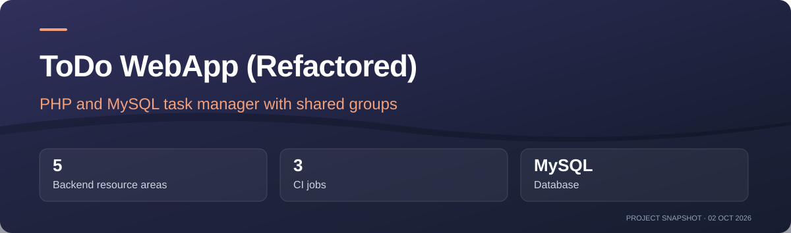

<!-- project-presentation:start -->



[](https://github.com/igor-vuta/todo-webapp-refactored/commits)
[](https://github.com/igor-vuta/todo-webapp-refactored)

**5** Backend resource areas · **3** CI jobs · **MySQL** Database

*Project facts checked 2 October 2026. Activity badges update from GitHub.*

<!-- project-presentation:end -->

<!-- project-pattern:start -->



<!-- project-pattern:end -->

# ToDo WebApp (Refactored)

A task manager with private lists, shared groups and a PHP/MySQL API. The frontend uses HTML, CSS and JavaScript modules; authentication uses JWTs.


*Dashboard with private lists, shared groups and the current task view.*

## Features

- Register and sign in, then create, edit and delete lists and tasks.
- Set task dates, times, status and priority; filter the task view by date.
- Create groups, invite members and associate lists or tasks with a group.
- Use the responsive dashboard and task editing dialogs.

## Screenshots


*Sign in to access your lists and tasks.*


*Create a task in the selected list with a date and time.*


*Edit the title, schedule, list and status of an existing task.*

## Run locally

Docker Compose starts MySQL, Apache/PHP and the static frontend. From the repository root:

```sh
docker compose up --build -d
docker exec -i todo-db mysql -u root todo_app < database/schema.sql
docker exec -i todo-db mysql -u root todo_app < database/indexes.sql
docker exec -i todo-db mysql -u root todo_app < database/seeds.sql
```

Open the frontend at `http://localhost:5173`; the API listens at `http://localhost:8000`. The seed data provides example users, lists, groups and tasks. The local Compose file uses development credentials and a placeholder JWT secret, so configure real secrets before hosting it for others. Stop the stack with `docker compose down`.

## Architecture

```text
frontend/
  index.html, start.html   Pages
  scripts/                 JavaScript modules for state, auth, lists, tasks and groups
  styles/                  CSS and SCSS sources
backend/
  auth/                    Registration, login and profile endpoints
  lists/, tasks/           List and task endpoints
  groups/, users/          Group membership and user endpoints
  middlewares/             Database, CORS and authentication helpers
  utils/                   JWT helper
database/                 Schema, indexes and demo seed
```

| Layer | Technology |
| --- | --- |
| Frontend | HTML, CSS/SCSS and JavaScript modules |
| API | PHP 8.2 and Apache |
| Data | MySQL 8 |
| Authentication | JWT |
| Local services | Docker Compose |
| Optional hosting | Railway container with Caddy and PHP |

## Optional Railway deployment

The repository includes `railway.json`, `Dockerfile.railway`, `Caddyfile.railway` and database initialization scripts for a single-container app. The deployment configuration serves the frontend at `/` and the API at `/api`. With a Railway project and database already configured, the included CLI command is:

```sh
railway up --service todo-app
```

The startup script attempts schema initialization and demo seeding on each launch; the scripts are designed to be idempotent. Configure the service before deployment:

| Variable | Purpose |
| --- | --- |
| `JWT_SECRET` | Secret used to sign authentication tokens; generate a unique value for hosting |
| `DB_HOST`, `DB_PORT` | MySQL address and port |
| `DB_NAME`, `DB_USER`, `DB_PASS` | MySQL database and credentials |
| `APP_ENV` | Set to `production` for the hosted environment |

The previous Railway deployment is unavailable, so this repository currently has no verified public demo link. For local development, the checked-in Compose file supplies its own database and API configuration.

## Checks

The GitHub Actions workflow checks PHP syntax, builds and validates the deployment image, and applies the MySQL schema and demo seed twice to check repeat setup.

## License

[MIT](LICENSE)
