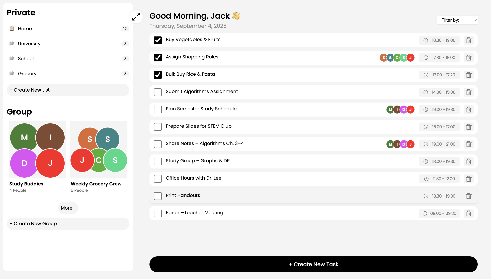
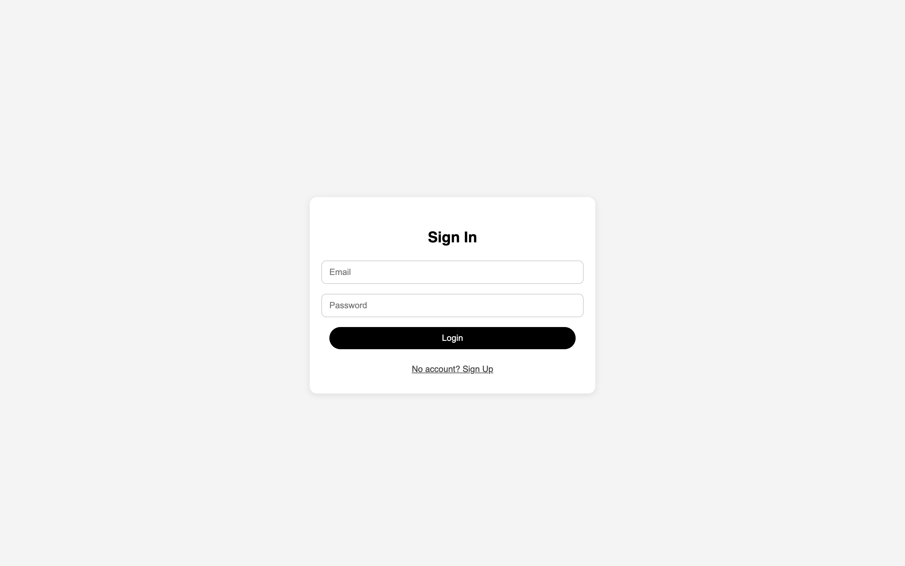
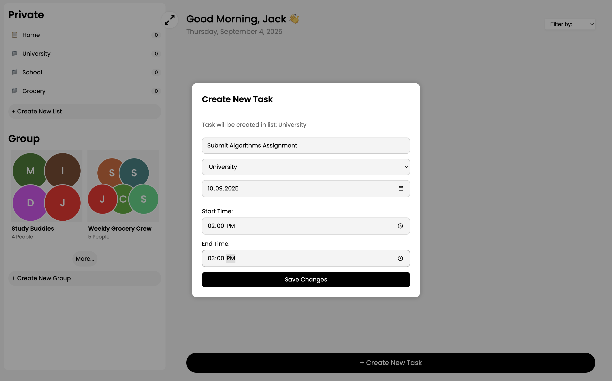
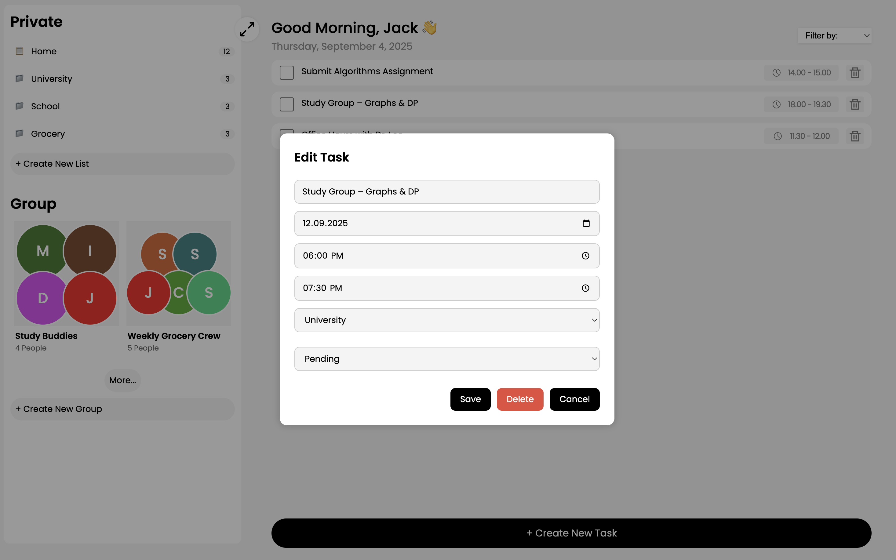

---


<div align="center">


## ✅ ToDo WebApp (Refactored)

Modern task management web application with lists, groups, authentication, and role-based features.

**[▶ Try the live demo](https://todo-app-production-5509.up.railway.app)**

Sign in with the shared demo account — no registration needed:

| Email | Password |
|---|---|
| `demo@todoapp.dev` | `Demo1234!` |

The demo database is seeded with example lists, groups and tasks. Anyone can sign in with it, so treat any data you add as public.

<br />



<em>Task dashboard - private lists and shared groups on the left, the day's tasks on the right. Avatars on a row mark a task shared with a group.</em>

</div>


---

## 🚀 Quick Start

### Local Development (2 minutes)

```bash
# Start with Docker
docker-compose up -d

# Initialize database
docker exec -i todo-db mysql -u root todo_app < database/schema.sql
docker exec -i todo-db mysql -u root todo_app < database/seeds.sql
docker exec -i todo-db mysql -u root todo_app < database/indexes.sql
```

✅ App running at:
- **Frontend**: http://localhost:5173
- **Backend**: http://localhost:8000

### Cloud Deployment

Deployed on **Railway** as a single container (Caddy serves the frontend at `/` and the PHP API at `/api`):

```bash
railway up --service todo-app
```

The database schema and demo data are applied automatically on first boot.

---

## 📸 Screenshots

<div align="center">



<em>Sign in - JWT issued here, with the role carried in the token.</em>

<br /><br />



<em>Creating a task - the modal opens against whichever list is selected.</em>

<br /><br />



<em>Editing a task - status and list are both changeable, and Delete is available inline.</em>

</div>

---

## ✨ Overview

This project is a refactored ToDo WebApp designed to demonstrate a full-stack approach with a clean frontend, modular PHP backend, and MySQL database.

Key features:
	-	👤 Authentication → Register, login, JWT-based auth.
	-	📋 Task Management → Create, edit, delete tasks; filter by due date, priority, or status.
	-	🗂 Lists → Organize tasks into multiple lists (e.g. Personal, Work, Shopping).
	-	👥 Groups → Share and collaborate with other users.
	-	🔑 Role-based Access → Only authenticated users can access data.
	-	🧩 Responsive UI → Adaptive HTML/CSS with modern JavaScript modules.

⚠️ Current stage: core features working locally. README + screenshots showcase functionality.

---

## 🏗 Architecture

```text
frontend/                 → Static UI (HTML, CSS, JS modules)
  └── scripts/            → ES modules (auth, lists, tasks, groups, ui)
backend/                  → PHP routes and services
  ├── auth/               → login.php, register.php, profile.php
  ├── lists/              → CRUD for lists
  ├── tasks/              → CRUD for tasks
  ├── groups/             → group & member endpoints
  ├── users/              → user info endpoints
  ├── middlewares/        → db.php, cors.php, auth.php (JWT validate)
  └── utils/              → jwt.php helper
database/                 → schema.sql, indexes.sql, seeds.sql
docker-compose.yml        → local development stack (php, mysql, static frontend)
```

---

## ⚙️ Technology Stack

```
Layer	    Tools
Frontend	HTML5, CSS3, Vanilla JavaScript (ESM)
Backend	    PHP 8.2 + Apache
Database	MySQL 8 (with schema + seeds)
Auth	    JWT-based authentication
DevOps	    Docker Compose (db + php + frontend)
```

---

## 🚀 Local Development

Clone and run locally with Docker Compose:

git clone https://github.com/you/ToDoWebAppRefactoring-main.git
cd ToDoWebAppRefactoring-main
docker compose up --build

	-	🌐 Frontend → http://localhost:5173
	-	🔌 Backend API → http://localhost:8000
	-	🛢 MySQL DB → localhost:3306

Initialize database:

docker exec -i todo-db mysql -uroot -h127.0.0.1 -e 'CREATE DATABASE IF NOT EXISTS todo_app;'
docker exec -i todo-db mysql -uroot -h127.0.0.1 todo_app < database/schema.sql
docker exec -i todo-db mysql -uroot -h127.0.0.1 todo_app < database/indexes.sql
docker exec -i todo-db mysql -uroot -h127.0.0.1 todo_app < database/seeds.sql


---

## 🧩 Core Features Walkthrough
	1.	User Flow
	-	Register → login → get JWT token.
	-	Profile & session checked with token.
	2.	Lists
	-	Create private task lists.
	-	View tasks per list with counts.
	3.	Tasks
	-	Add tasks with title, due date, priority, status.
	-	Edit or delete tasks.
	-	Filter by today, week, or month.
	4.	Groups
	-	Create groups.
	-	Invite other users (mocked/demo ready).
	-	See group members.
	5.	Responsive UI
	-	Sidebar for lists & groups.
	-	Main panel for tasks.
	-	Modals for CRUD operations.

---

## 🚦 Git Workflow & Code Quality
	-	✅ ESLint + Prettier for frontend JS.
	-	✅ Conventional Commits supported.
	-	✅ Modular PHP backend (routes, middlewares, utils).

Example:

git commit -m "feat(tasks): add priority filter"


---

## 🌐 Cloud Hosting

### 🏆 Railway
```bash
railway up --service todo-app
```
- ✅ Native PHP + MySQL support
- ✅ Single image: frontend at `/`, API at `/api` (no CORS setup needed)
- ✅ Schema + demo data seeded automatically on first boot

Build config lives in [`railway.json`](railway.json) → [`Dockerfile.railway`](Dockerfile.railway).

### Environment Variables

Generate a secure JWT secret:
```bash
openssl rand -base64 32
```

Set in your platform:
- `JWT_SECRET` - Your generated secret
- `DB_HOST`, `DB_PORT`, `DB_NAME`, `DB_USER`, `DB_PASS` - Database connection
- `APP_ENV` - `production`

---

## 📜 License

MIT License
	-	✅ Free to use, modify, distribute.
	-	✅ Great for portfolio/demo use.
	-	❌ No warranty.

---

## 🏆 Summary
	-	📋 Full-stack ToDo app: authentication, lists, groups, tasks.
	-	🖥 Docker-based local setup (frontend + backend + DB).
	-	🔑 JWT-secured API with modular PHP.
	-	🎨 Responsive frontend built with HTML/CSS/JS.
	-	🚧 Demo-ready: run locally or showcase with screenshots/mock data.
